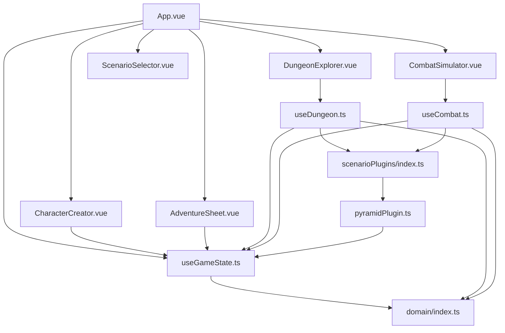
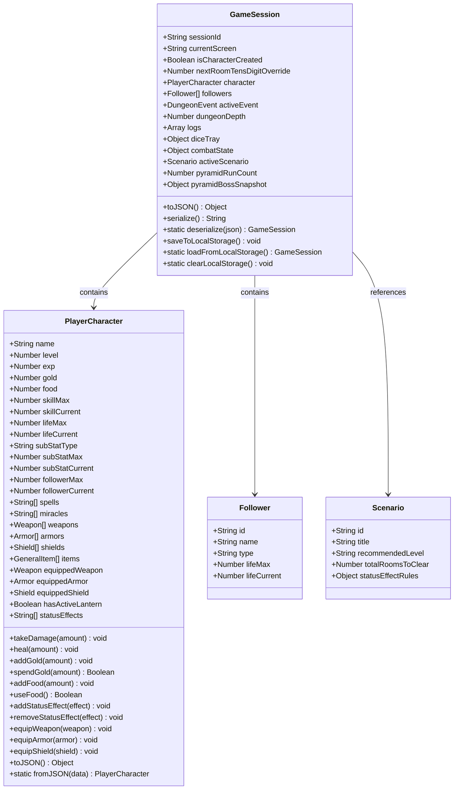
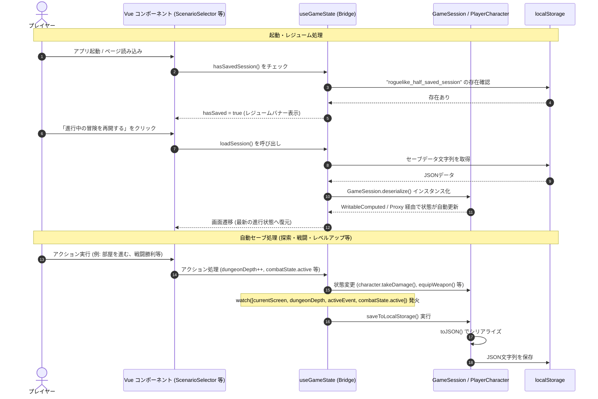

# 設計・アーキテクチャ 仕様書 (Architecture & System Specification)

本ドキュメントは、テーブルトークRPG/ボードゲームのシステムをVue 3 + TypeScript (Vite) を用いてSPAとして構築した `roguelike-half` のフロントエンド設計、ドメインモデル、およびセッション永続化機構について定義するシステム仕様書です。

---

## 1. システム構造とモジュール構成

本システムは、Vue 3のComposition APIのリアクティブ特性とオブジェクト指向のドメイン駆動設計を組み合わせたSPA構成をとっています。ゲームの進行や状態変更などの主要なビジネスロジックは、Vueコンポーネントから完全に分離され、ドメインモデルおよびComposables層に集約されています。

### 1.1 ディレクトリ構成と役割

```
src/
├── types/
│   └── index.ts               # ゲームドメイン（Character, Enemy, Scenario等）のインターフェース型定義
├── data/
│   └── scenarios/
│       └── *.json             # シナリオ定義データ（イベント、遭遇エネミー、報酬等のテーブル定義）
├── domain/
│   └── index.ts               # カプセル化されたドメインモデル（PlayerCharacter, GameSessionクラス）
├── composables/
│   ├── useGameState.ts        # セッションのライフサイクル管理、リアクティブ・ブリッジ、共通ユーティリティ
│   ├── useDungeon.ts          # ダンジョン探索状態の進行、トラップ・遭遇イベントの調停処理
│   ├── useCombat.ts           # ターン制戦闘システム、ダイス判定ロール、ダメージ解決エンジン
│   └── scenarioPlugins/
│       ├── index.ts           # シナリオ拡張プラグインのインターフェース定義とフックディスパッチャー
│       └── pyramidPlugin.ts   # ピラミッドシナリオ固有の特殊ルール処理（クロノヴァルスの咆哮等）
├── components/
│   ├── CharacterCreator.vue   # キャラクター初期作成画面UI
│   ├── AdventureSheet.vue     # ステータス・装備・背負い袋・従者管理を行う記録紙パネル
│   ├── DungeonExplorer.vue    # ダンジョンの部屋探索・トラップ挑戦・イベントの進行UI
│   ├── CombatSimulator.vue    # 戦闘シミュレーターおよび行動コマンドUI
│   └── ScenarioSelector.vue   # シナリオ選択およびセーブデータ再開バナーUI
├── App.vue                    # アプリケーション全体のレイアウト調整、宿屋・ショップ統合ビュー
└── main.ts                    # エントリーポイント
```

### 1.2 モジュール間の依存関係 (Mermaid)



---

## 2. 状態管理とセッションモデル

ゲーム全体の「状態（State）」は、単一のグローバルなシングルトンではなく、シリアライズ可能な `GameSession` インスタンスとしてカプセル化されます。これにより、オートセーブやセーブ/ロード、将来的なマルチプレイ対応が容易な設計となっています。

### 2.1 ドメインモデル（PlayerCharacter / GameSession）
* **`PlayerCharacter` クラス**:
  * 従来のプレーンオブジェクトとしての `Character` データをラップし、生命力のダメージ解決（`takeDamage`）、回復（`heal`）、金貨消費（`spendGold`）、装備の切り替え（`equipWeapon`, `equipArmor`, `equipShield`）などのビジネスロジックをメソッド内にカプセル化しています。
  * 装備変更の際には「両手武器の装備時に自動で盾を取り外す」「防具の変更に伴って最大生命力（`lifeMax`）と現在生命力（`lifeCurrent`）を安全に再計算する」といったガードロジックがモデル内で実行されます。
* **`GameSession` クラス**:
  * 進行中の画面（`currentScreen`）、キャラクター、同行している従者（`followers`）、現在のイベント（`activeEvent`）、階層の深度（`dungeonDepth`）、ログ（`logs`）、ダイストレイ（`diceTray`）、戦闘状態（`combatState`）を含む**すべてのゲームステート**をインスタンス内に保持します。

### 2.2 リアクティブ・ブリッジ（互換レイヤー）
Vueコンポーネントや他の Composable との結合を疎結合に保つため、`useGameState.ts` 内部では `activeSession`（`ref<GameSession>`）を定義し、従来外部にエクスポートしていた個別のリアクティブ変数を**ゲッター/セッター付きの `computed`** および **`Proxy`** を用いてラップしています。

* **`computed` によるブリッジ**: `character`, `followers`, `dungeonDepth` などのデータは、アクティブセッションのメンバを参照する `computed` プロパティとして公開されます。セッターを備えているため、`character.value = { ... }` のような再代入時にも自動的に `PlayerCharacter` インスタンスに変換され、既存のコンポーネントコードに変更を強いることなく完全なオブジェクト指向への移行を両立しています。
* **`Proxy` によるブリッジ**: `diceTray` や `combatState` などの非破壊代入や直接アクセスが多い `reactive` オブジェクトは、Proxyオブジェクトを介してアクセスをアクティブセッション内の対応プロパティへ転送します。これにより、Vueの依存関係追跡機能を維持したまま互換性を完全に担保しています。

---

## 3. クラス設計と自動セーブ・レジューム設計

### 3.1 クラス関連図 (Mermaid Class Diagram)



### 3.2 オートセーブ・レジュームのシーケンス (Mermaid Sequence Diagram)



---

## 4. データドリブン設計とプラグイン・アーキテクチャ

拡張性と堅牢性を確保するため、本システムはコアエンジンを変更せずにゲームデータを容易に拡張できる設計を採用しています。

### 4.1 エネミー・トラップのデータドリブン化
戦闘ロジック（`useCombat.ts`）に直接ハードコードされていた敵個別の耐性や、特定の特効武器（例: 悪魔殺しの剣、シルバーダガー）の例外ルールは、すべてデータ属性駆動へと移行されました。
* **`Enemy` インターフェースの拡張**: 耐性テーブル（`resistances`）、攻撃回数補正（`evasionRule`）、武器・道具との特効効果判定などをすべて属性データとしてシナリオ定義（`pyramid_of_chronodemon.json` 等）へと切り出しました。
* **汎用ルールの適用**: コア戦闘ロジックは、敵データの属性値を元に判定のプラスマイナス修正やダメージ補正を動的に計算する仕様となり、コード内の例外的なif分岐は完全に一掃されています。

### 4.2 プラグイン・アーキテクチャ (ScenarioPlugin)
シナリオに特有の複雑な進行や特殊イベントロジックは、コアロジックを汚すことなく、プラグインインターフェースに隠蔽されています。
* **フックディスパッチャー (`scenarioPlugins/index.ts`)**: シナリオに対応するプラグインが存在する場合に、定義された特定のフックを順次実行して制御をプラグインに委譲します。
* **追加フック**: ダンジョン探索時の特定マス強制（`onExploreRoomOverride`）、戦闘時の特殊攻撃回数算出（`onDetermineEnemyAttackCount`）、特定エネミーAIの手番構築（`onGenerateEnemyAttacks`）、防御失敗時のデバフや即死処理（`onResolveDefenseAttack`）、ラウンド終了時効果（`onCombatRoundEnd`）など、細かいゲームライフサイクルに割り込むフックを提供しています。

### 4.3 疎結合なドメインイベント駆動
画面の遷移処理や進行状態の制御は、`currentScreen.value = 'explore'` のように直接変更するのではなく、`useGameState.ts` 内に定義されたドメインイベントメソッドを呼び出す設計に統一されています。
* **進行メソッド例**: `triggerGameOver()`, `triggerLevelUp()`, `transitionToExplore()`, `transitionToCombat()`, `transitionToSuccess()`
* これにより、ドメインロジックの実行からUIへのフィードバック経路が一元化され、表示と制御の疎結合性が確保されています。
