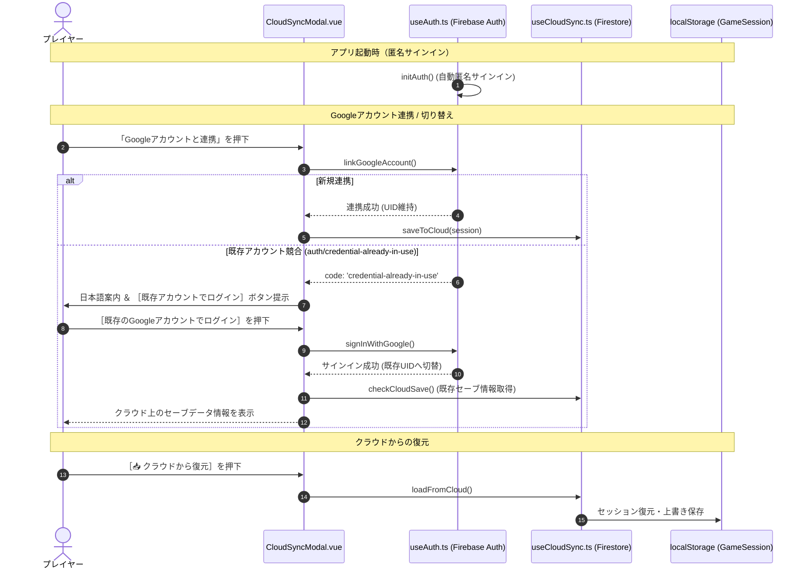

# システム設計・アーキテクチャ仕様書 (System Architecture & Specification)

本ドキュメントは、TRPG「ローグライクハーフ」をVue 3 + TypeScript (Vite) を用いてSPAとして構築した `roguelike-half` のフロントエンド設計、ドメインモデル、認証・クラウド同期機構、および状態管理について定義するシステム仕様書です。

---

## 1. システム概要と技術スタック

本システムは、Vue 3のComposition APIとオブジェクト指向のドメイン駆動設計（DDD）を融合させた、軽量かつ拡張性の高いシングルページアプリケーション（SPA）です。

- **フロントエンドフレームワーク**: Vue 3 (Composition API / `<script setup>`)
- **プログラミング言語**: TypeScript 5.x（厳格な型安全性を確保）
- **ビルドツール**: Vite 8.x
- **バックエンド / BaaS**: Firebase (Auth / Cloud Firestore)
- **ホスティング**: Firebase App Hosting
- **状態管理方針**: 外部ストアライブラリ（Vuex/Pinia等）に依存せず、Composable関数とドメインクラス、およびリアクティブ・ブリッジを用いたゼロ依存ステート管理。

---

## 2. ディレクトリ構成とモジュール設計

```
src/
├── types/
│   └── index.ts                 # 全ドメインのインターフェース型定義（Character, Enemy, Scenario等）
├── domain/
│   ├── index.ts                 # カプセル化されたドメインモデル（PlayerCharacter, GameSession）
│   └── random.ts                # 暗号論的/疑似乱数ユーティリティ
├── data/
│   └── scenarios/               # ビルトイン公式シナリオJSONデータ群
│       ├── public/              # 一般公開シナリオ（死者のカタコンベ等）
│       └── mock/                # 特殊ギミック検証用シナリオ（ピラミッド等）
├── composables/
│   ├── useGameState.ts          # セッションのライフサイクル管理、リアクティブ・ブリッジ、共通ユーティリティ
│   ├── useDungeon.ts            # ダンジョン探索状態の進行、トラップ・遭遇イベントの調停処理
│   ├── useCombat.ts             # ターン制戦闘システム、ダイス判定ロール、ダメージ解決エンジン
│   ├── useAuth.ts               # Firebase Auth（匿名認証、Google連携、ログアウト、既存アカウント切替）
│   ├── useCloudSync.ts          # Firestoreへの自動/手動バックアップ、セーブデータ軽量化、復元処理
│   ├── useCustomScenarios.ts    # カスタムシナリオ管理、JSON入出力、適正レベル自動計算
│   ├── useHallOfFame.ts         # 迷宮踏破した英雄の殿堂データ管理
│   ├── useSettings.ts           # ゲーム環境設定（ダイス演出ON/OFF等）のLocalStorage永続化
│   └── scenarioPlugins/         # シナリオ固有の拡張フックディスパッチャー
│       ├── index.ts             # プラグインインターフェースとディスパッチ機構
│       └── pyramidPlugin.ts     # ピラミッド固有ギミック（クロノヴァルスの咆哮等）
├── components/
│   ├── ScenarioSelector.vue     # シナリオ選択、自作シナリオ一覧、二次創作ガイドライン表示
│   ├── ScenarioEditor.vue       # シナリオ工房（ブラウザ上でのダンジョン作成・編集）
│   ├── CharacterCreator.vue     # キャラクター初期作成画面UI
│   ├── DungeonExplorer.vue      # ダンジョン部屋探索、イベント分岐、トラップ判定UI
│   ├── CombatSimulator.vue      # ターン制戦闘シミュレーターUI（通常攻撃、魔法、道具、逃走）
│   ├── AdventureSheet.vue       # 冒険記録紙（ステータス、装備、背負い袋、従者管理）
│   ├── MiniStatusHud.vue        # 画面上部固定ミニステータスバー ＆ ステータス詳細モーダル
│   ├── DiceRoller.vue           # 運命のダイス（自動フェード3Dダイストレイ・オーバーレイモーダル）
│   ├── SettingsModal.vue        # 環境設定モーダル（演出ON/OFF等の切り替え）
│   ├── CloudSyncModal.vue       # クラウド同期・Googleアカウント連携モーダル
│   └── HallOfFameModal.vue      # 冒険の殿堂（踏破英雄一覧）モーダル
├── firebase/
│   └── config.ts                # Firebase初期化設定
├── App.vue                      # アプリケーション全体のルートレイアウト、ログブック
└── main.ts                      # エントリーポイント
```

---

## 3. モジュール間の依存関係 (Mermaid)

```mermaid
graph TD
    %% Views / App
    App[App.vue] --> MSH[MiniStatusHud.vue]
    App --> DR[DiceRoller.vue]
    App --> SS[ScenarioSelector.vue]
    App --> CC[CharacterCreator.vue]
    App --> DE[DungeonExplorer.vue]
    App --> CS[CombatSimulator.vue]
    
    %% MiniStatusHud Modals
    MSH --> AS[AdventureSheet.vue (Modal)]
    MSH --> SM[SettingsModal.vue]
    
    %% ScenarioSelector Modals
    SS --> CSM[CloudSyncModal.vue]
    SS --> HFM[HallOfFameModal.vue]
    SS --> SE[ScenarioEditor.vue]
    SS --> SM

    %% Composables Layer
    App --> UGS[useGameState.ts]
    DE --> UD[useDungeon.ts]
    CS --> UC[useCombat.ts]
    DR --> UGS
    DR --> USET[useSettings.ts]
    SM --> USET
    
    UD --> UGS
    UC --> UGS
    
    CSM --> UA[useAuth.ts]
    CSM --> UCS[useCloudSync.ts]
    HFM --> UHF[useHallOfFame.ts]
    SE --> UCSC[useCustomScenarios.ts]
    
    UCS --> UA
    UCSC --> UA
    UHF --> UA

    %% Domain Layer
    UGS --> DOM[domain/index.ts (GameSession / PlayerCharacter)]
    UD --> DOM
    UC --> DOM
    UCS --> DOM

    %% Scenario Plugins
    UD --> SP[scenarioPlugins/index.ts]
    UC --> SP
    SP --> PP[pyramidPlugin.ts]
    PP --> UGS
```

---

## 4. 状態管理とリアクティブ・ブリッジ

### 4.1 ドメインモデルのカプセル化
本システムでは、ゲーム状態を単一のグローバルプレーンオブジェクトではなく、オブジェクト指向でカプセル化された `GameSession` および `PlayerCharacter` クラスとして管理しています。

* **`PlayerCharacter` クラス**:
  - 生命力のダメージ解決（`takeDamage`）、回復（`heal`）、所持金管理（`spendGold`, `addGold`）、食料消費、従者枠計算などのビジネスルールを集約。
  - 武器・防具・盾の装備変更時に、盾と両手武器の排他制御や最大HP/現在HPの安全な再計算をモデル内部で保証。
* **`GameSession` クラス**:
  - `character`, `followers`, `dungeonDepth`, `activeEvent`, `combatState`, `logs`, `diceTray`, `activeScenario` など、セッション全体のステートを完全保持。
  - `toJSON()` / `deserialize()` により、LocalStorageおよびFirestoreへのシリアライズ/デシリアライズを単一責任として実行。

### 4.2 リアクティブ・ブリッジ機構
Vueコンポーネントがドメインモデルを直接参照すると、Vueのリアクティビティ（依存関係追跡）が失われたり、逆に不要な再描画が発生するリスクがあります。これを解決するため、`useGameState.ts` 内部で**リアクティブ・ブリッジ**を構築しています。

1. **`computed` によるプロキシブリッジ**:
   - `character` や `followers` などのステートは、ゲッター/セッター付きの `computed` として公開。
   - `character.value = { ... }` といった代入が行われた場合でも、セッター内部で自動的に `PlayerCharacter` インスタンスへ再変換され、整合性が保たれます。
2. **`Proxy` による透過的リアクティビティ**:
   - `diceTray` や `combatState` など、頻繁にプロパティ更新が発生するオブジェクトは、Proxy経由でアクティブセッション内のプロパティへアクセスを転送し、Vueのリアクティビティを完全維持します。

---

## 5. 認証・クラウド同期アーキテクチャ

Firebase Authentication と Cloud Firestore を活用し、安全かつシームレスなデータ永続化を提供しています。



### 5.1 セーブデータの軽量化サニタイズ (`sanitizeForCloud`)
Firestoreへの書き込みサイズおよび通信量を最小化（無料枠の保護）するため、`useCloudSync.ts` では保存前にログ履歴を直近5件にトリミングし、数KB程度の軽量ドキュメントに変換して保存します。

---

## 6. UI/UXアーキテクチャ

* **中央1カラム・洋書レイアウト (`App.vue`)**:
  - PC・スマートフォン問わず、中央最大幅900pxの美しいゲームブック形式を採用。
* **画面上部ステータスHUD (`MiniStatusHud.vue`)**:
  - HPバー、技量、副能力、食料、金貨、従者数を固定表示。
  - 右端の［📜 ステータス詳細］から全画面ドロワーモーダルで冒険記録紙（所持品・特技管理）を開閉可能。二重スクロールバーを防止するシングルスクロール設計。
* **運命のダイス・オーバーレイ (`DiceRoller.vue`)**:
  - ダイス判定時に画面中央へ3Dダイストレイが自動ポップアップし、1.5秒後に自動フェードアウト（クリックで即スキップ可能）。
  - `SettingsModal.vue` からのトグル設定（`useSettings.ts`）により、ダイス演出を完全にOFFにして高速テキスト進行に切り替えることも可能。
